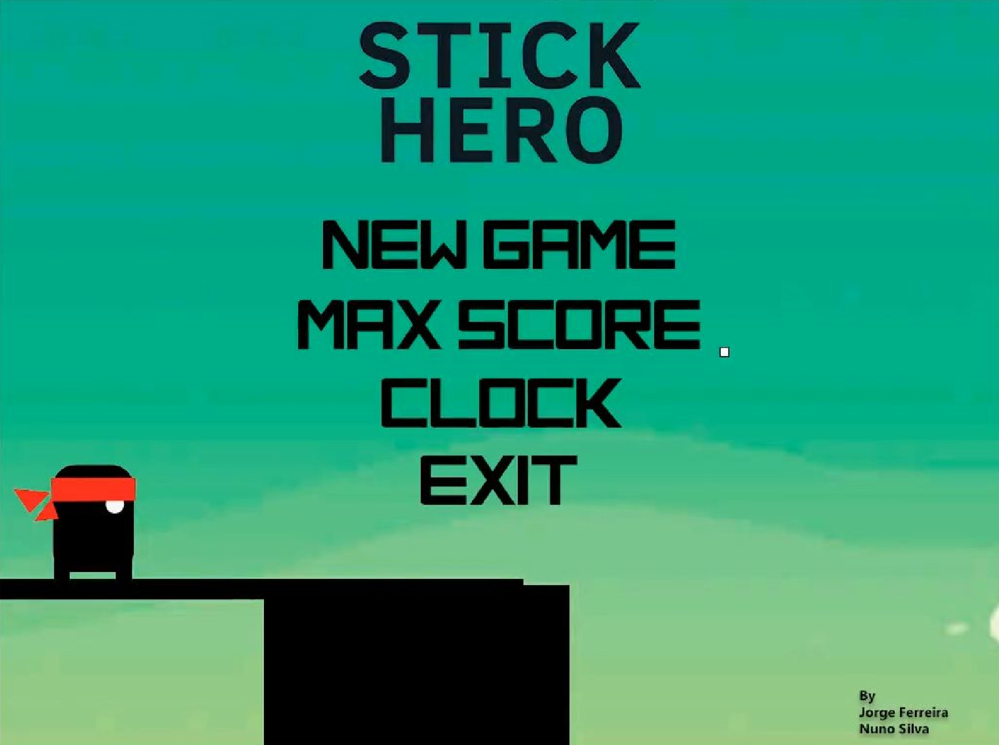
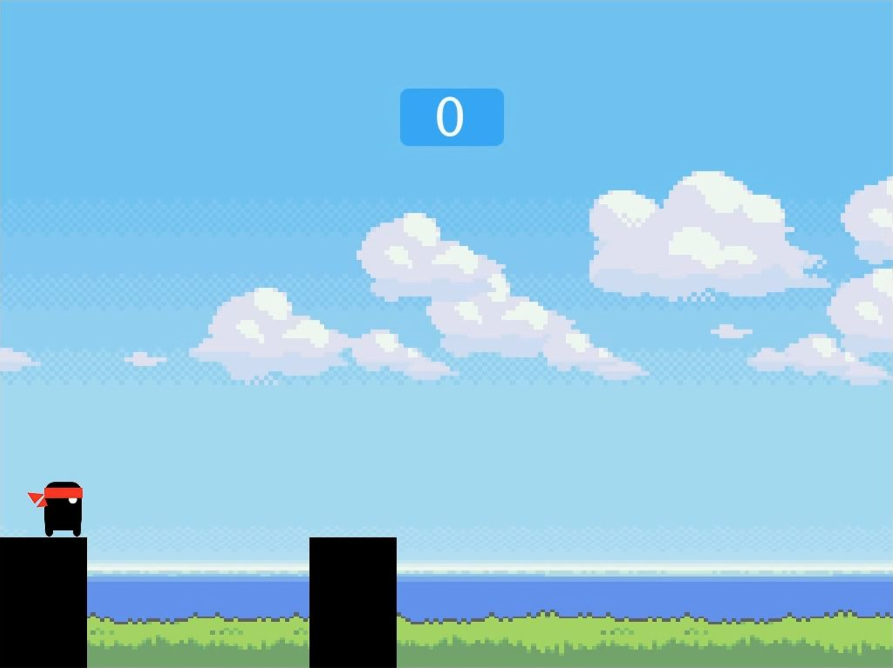
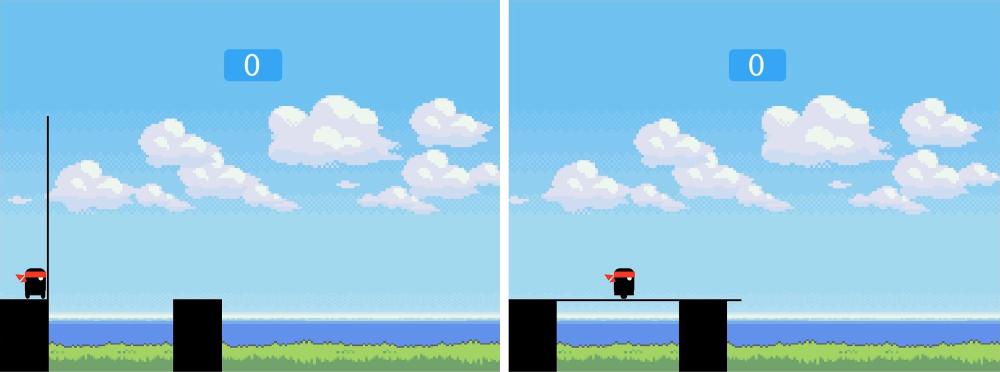

# LCOM Computer Laboratory
Projects made in Computer Laboratory class - MIEIC 2y1s 

"Labs" contains the implementation of the class challenges. "Projetos" contains the project of the class. 

## Stick Hero in Minix

This project aims to show the interaction between the different peripherals in Minix by the implementation of the game "Stick Hero". The game uses the following peripherals: keyboard, mouse, timer, RTC and the video card. The development was done in C with the Eclipse IDE. The game runs in Minix, running in VirtualBox. 

### The game also has animations. Here is a video showing the game: https://www.youtube.com/watch?v=L_zy3ML_cSs
# 

### How to run
Inside Minix run this:
> cd lcom1516-t6g10/proj/StickHero/source/
>
>su
>
>sh cpyconf.sh
>
>make
>
>sh run.sh

